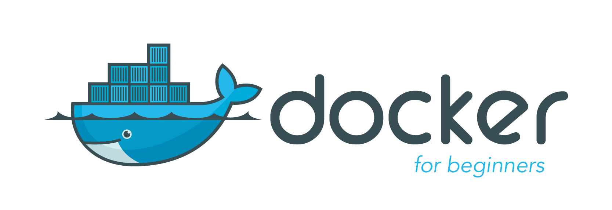
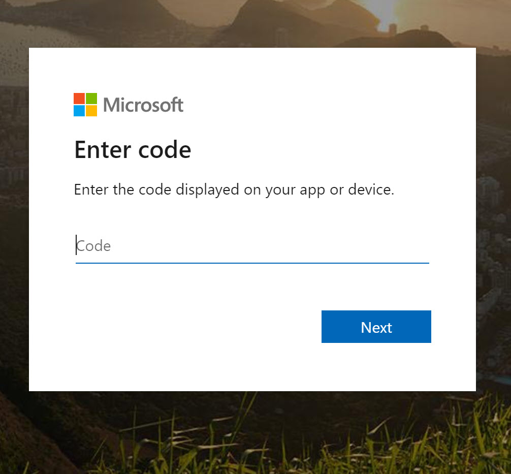
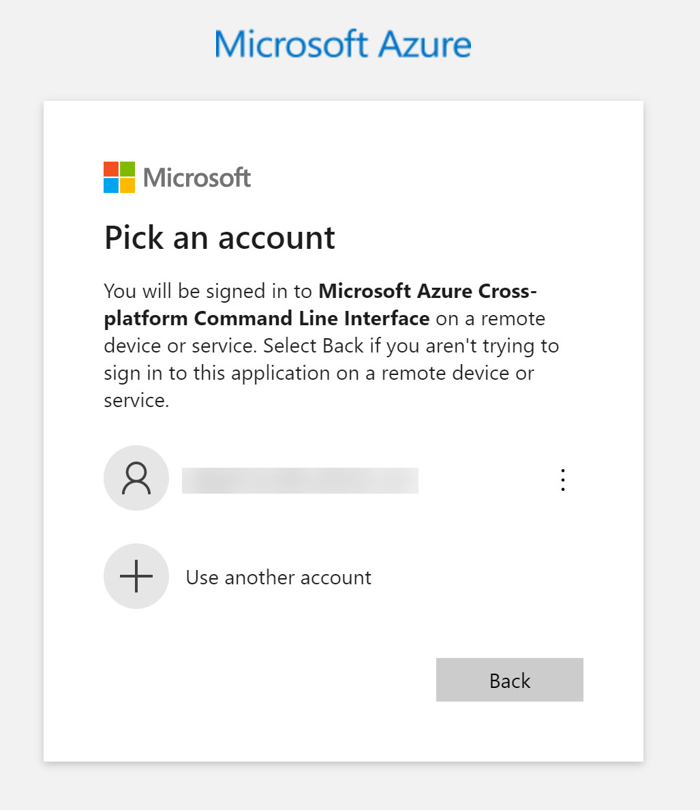
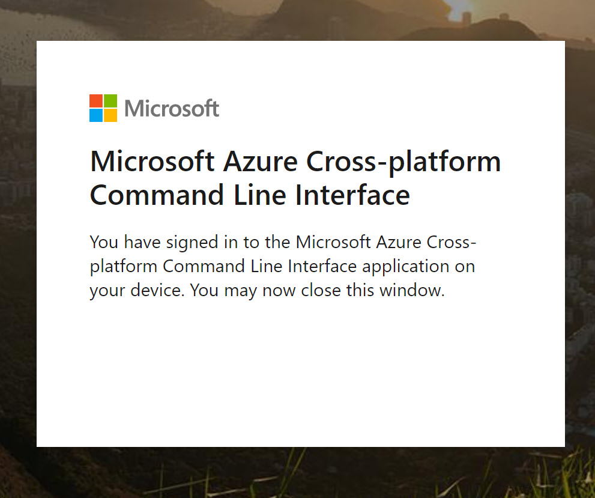
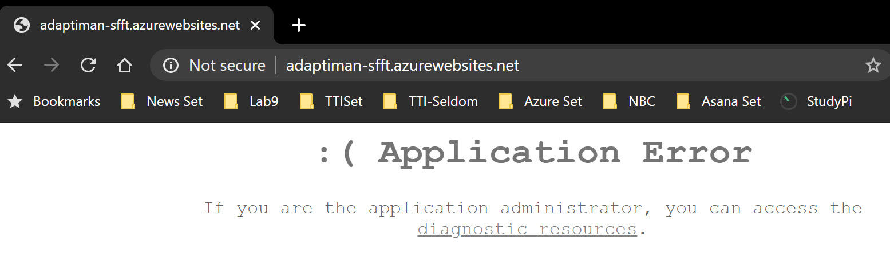

<a id="top"></a>


*Learn to build and deploy your distributed applications easily to the cloud with Docker*
## Multi-Container Orchestration
This tutorial was originally written and developed by [Prakhar Srivastav](http://prakhar.me) and modified by [David Sweeney](https://adaptiman.github.io) for TCMG303 to include how to setup an Azure App Service to support a multi-container application. In this lab, you will build and deploy an application consisting of multiple containers with a Docker virtual network. After building and testing locally, you will deploy our application to Azure App Service.

<a href="#top" class="top" id="getting-started">Top</a>

## Using this Document
This document contains several sections, each of which explains a particular aspect of deploying Docker containers. In each section, we will be typing commands (or writing code). The dollar sign ($) or number sign (#) signifies a command prompt, at which you would type a command.

<a href="#top" class="top" id="table-of-contents">Top</a>
## Table of Contents

-	[Preface](#preface)
-	[Pre-requisites](#prerequisites)
- [4.0 Multi-Container Environments](#multi-container)
  - [4.1 SF Food Trucks](#foodtrucks)
  - [4.2 Docker Network](#docker-network)
    - [4.2.1 Patching a Container](#patching)
    - [4.2.2 Docker Links](#docker-links)
  - [4.3 Docker Compose](#docker-compose)
  - [4.4 Azure Web App Service](#azure-webapp)
    - [4.4.1 Installing Azure CLI](#azcli)
    - [4.4.2 Deploying to Azure App Service](#azureas)
- [5.0 Submitting the Lab](#submitlab)
- [References](#references)


------------------------------
<a href="#table-of-contents" class="top" id="preface">Top</a>
## Preface

> Note: This tutorial uses version **1.40** of Docker Community Edition. If you find any part of the tutorial incompatible with a future version, please raise an [issue](https://github.com/adaptiman/lab10/issues). Thanks!

<a href="#table-of-contents" class="top" id="preface">Top</a>
<a id="prerequisites"></a>
### Prerequisites
This lab is built upon the Virtual Machine (VM) you built in [Lab9](https://github.com/adaptiman/lab9). This VM consisted of an Ubuntu 18.04LTS image patched and deployed in Azure, with Docker CE installed. If you do not have access to this development environment, STOP and complete [Lab9](https://github.com/adaptiman/lab9). This lab also assumes that you have accounts on each of these websites:

- [Azure Web Services](http://azure.microsoft.com/en-us/)
- [Docker Hub](https://hub.docker.com/)

To prepare for the lab, SSH into your VM from Lab 9, and clone Lab 10 in your home directory:
```
$ git clone https://github.com/adaptiman/lab10.git
```

<a href="#table-of-contents" class="top" id="preface">Top</a>
<a id="multi-container"></a>
## 4.0 Multi-container Environments
In the last lab, we saw how easy and fun it is to run applications with Docker. We started with a simple static website and then tried a Flask app. Both of which we could run locally and in the cloud with just a few commands. One thing both these apps had in common was that they were running in a **single container**.

Those of you who have experience running services in production know that usually apps nowadays are not that simple. There's almost always a database (or any other kind of persistent storage) involved. Systems such as [Redis](http://redis.io/) and [Memcached](http://memcached.org/) have become *de riguer* of most web application architectures. Hence, in this section we are going to spend some time learning how to Dockerize applications which rely on different services to run.

In particular, we are going to see how we can run and manage **multi-container** docker environments. Why multi-container you might ask? Well, one of the key points of Docker is the way it provides isolation. The idea of bundling a process with its dependencies in a sandbox (called containers) is what makes this so powerful.

Just like it's a good strategy to decouple your application tiers, it is wise to keep containers for each of the **services** separate. Each tier is likely to have different resource needs and those needs might grow at different rates. By separating the tiers into different containers, we can compose each tier using the most appropriate instance type based on different resource needs. This also plays in very well with the whole [microservices](http://martinfowler.com/articles/microservices.html) movement which is one of the main reasons why Docker (or any other container technology) is at the [forefront](https://medium.com/aws-activate-startup-blog/using-containers-to-build-a-microservices-architecture-6e1b8bacb7d1#.xl3wryr5z) of modern microservices architectures.

<a href="#table-of-contents" class="top" id="preface">Top</a>
<a id="foodtrucks"></a>
### 4.1 SF Food Trucks

The app that we're going to Dockerize is called [SF Food Trucks](https://github.com/prakhar1989/FoodTrucks). My goal in building this app was to have something that is useful (in that it resembles a real-world application), relies on at least one service, but is not too complex for the purpose of this tutorial. This is what I came up with.


The app's backend is written in Python (Flask) and for search it uses [Elasticsearch](https://www.elastic.co/products/elasticsearch). Like everything else in this tutorial, the entire source is available on [Github](http://github.com/prakhar1989/FoodTrucks). We'll use this as our candidate application for learning out how to build, run and deploy a multi-container environment.

Now that you're excited (hopefully), let's think of how we can Dockerize the app. We can see that the application consists of a Flask backend server and an Elasticsearch service. A natural way to split this app would be to have two containers - one running the Flask process and another running the Elasticsearch (ES) process. That way if our app becomes popular, we can scale it by adding more containers depending on where the bottleneck lies.

Great, so we need two containers. That shouldn't be hard right? We've already built our own Flask container in the previous lab. And for Elasticsearch, let's see if we can find something on the hub.
```
$ docker search elasticsearch
NAME                                 DESCRIPTION                                     STARS               OFFICIAL            AUTOMATED
elasticsearch                        Elasticsearch is a powerful open source sear…   4303                [OK]
nshou/elasticsearch-kibana           Elasticsearch-7.5.1 Kibana-7.5.1                118                                     [OK]
itzg/elasticsearch                   Provides an easily configurable Elasticsearc…   70                                      [OK]
mobz/elasticsearch-head              elasticsearch-head front-end and standalone …   60
elastichq/elasticsearch-hq           Official Docker image for ElasticHQ: Elastic…   50                                      [OK]
elastic/elasticsearch                The Elasticsearch Docker image maintained by…   31
bitnami/elasticsearch                Bitnami Docker Image for Elasticsearch          29                                      [OK]
taskrabbit/elasticsearch-dump        Import and export tools for elasticsearch       21                                      [OK]
lmenezes/elasticsearch-kopf          elasticsearch kopf                              18                                      [OK]
barnybug/elasticsearch               Latest Elasticsearch 1.7.2 and previous rele…   17                                      [OK]
justwatch/elasticsearch_exporter     Elasticsearch stats exporter for Prometheus     15
esystemstech/elasticsearch           Debian based Elasticsearch packing for Lifer…   15
monsantoco/elasticsearch             ElasticSearch Docker image                      11                                      [OK]
blacktop/elasticsearch               Alpine Linux based Elasticsearch Docker Image   11                                      [OK]
mesoscloud/elasticsearch             [UNMAINTAINED] Elasticsearch                    9                                       [OK]
centerforopenscience/elasticsearch   Elasticsearch                                   4                                       [OK]
dtagdevsec/elasticsearch             elasticsearch                                   3                                       [OK]
barchart/elasticsearch-aws           Elasticsearch AWS node                          3
bitnami/elasticsearch-exporter       Bitnami Elasticsearch Exporter Docker Image     2                                       [OK]
axway/elasticsearch-docker-beat      "Beat" extension to read logs of containers …   1                                       [OK]
jetstack/elasticsearch-pet           An elasticsearch image for kubernetes PetSets   1                                       [OK]
phenompeople/elasticsearch           Elasticsearch is a powerful open source sear…   1                                       [OK]
wreulicke/elasticsearch              elasticsearch                                   0                                       [OK]
18fgsa/elasticsearch-ha              Built from https://github.com/18F/kubernetes…   0
18fgsa/elasticsearch                 Built from https://github.com/docker-library…   0

$
```
Quite unsurprisingly, there exists an officially supported [image](https://hub.docker.com/_/elasticsearch/) for Elasticsearch. To get ES running, we can simply use `docker run` and have a single-node ES container running locally within no time. Note that currently, there are issues with the Docker elasticsearch image, and so we'll use the published image from the creator (referencing a known working version):
```
$ docker run -d --name es -p 9200:9200 -p 9300:9300 -e "discovery.type=single-node" docker.elastic.co/elasticsearch/elasticsearch:6.3.2
...
224a97d6bc54829f8be84b48d230f06ff316d07da150c1a4df4e74baeceeb5a3

$
```
Test the container:
```
$ curl 0.0.0.0:9200
{
  "name" : "i8XWXyN",
  "cluster_name" : "docker-cluster",
  "cluster_uuid" : "rB1jCx7vTqK5n97AtK8_Ig",
  "version" : {
    "number" : "6.3.2",
    "build_flavor" : "default",
    "build_type" : "tar",
    "build_hash" : "053779d",
    "build_date" : "2018-07-20T05:20:23.451332Z",
    "build_snapshot" : false,
    "lucene_version" : "7.3.1",
    "minimum_wire_compatibility_version" : "5.6.0",
    "minimum_index_compatibility_version" : "5.0.0"
  },
  "tagline" : "You Know, for Search"
}

$
```
While we are at it, let's get our Flask container running too. But before we get to that, we need a `Dockerfile`. In the last section, we used `python:3-onbuild` image as our base image. This time, however, apart from installing Python dependencies via `pip`, we want our application to also generate our [minified Javascript file](http://sf-foodtrucks.xyz/static/build/main.js) for production. For this, we'll require Nodejs. Since we need a custom build step, we'll start from the `ubuntu` base image to build our `Dockerfile` from scratch.

> Note: if you find that an existing image doesn't cater to your needs, feel free to start from another base image and tweak it yourself. For most of the images on Docker Hub, you should be able to find the corresponding `Dockerfile` on Github. Reading through existing Dockerfiles is one of the best ways to learn how to roll your own.


Our [Dockerfile](Dockerfile) for the flask app looks like below -
```
# start from base
FROM ubuntu:latest

# install system-wide deps for python and node
RUN apt -yqq update
RUN apt -yqq install python-pip python-dev curl gnupg
RUN curl -sL https://deb.nodesource.com/setup_10.x | bash
RUN apt install -yq nodejs

# copy our application code
ADD flask-app /opt/flask-app
WORKDIR /opt/flask-app

# fetch app specific deps
RUN npm install
RUN npm run build
RUN pip install -r requirements.txt

# expose port
EXPOSE 5000

# start app
CMD [ "python", "./app.py" ]
```
Quite a few new things here so let's quickly go over this file. We start off with the [Ubuntu LTS](https://wiki.ubuntu.com/LTS) base image and use the package manager `apt` to install the dependencies namely - Python and Node. The `yqq` flag is used to suppress output and assumes "Yes" to all prompt. We also create a symbolic link for the node binary to deal with backward compatibility issues.

We then use the `ADD` command to copy our application into a new volume in the container - `/opt/flask-app`. This is where our code will reside. We also set this as our working directory, so that the following commands will be run in the context of this location. Now that our system-wide dependencies are installed, we get around to install app-specific ones. First off we tackle Node by installing the packages from npm and running the build command as defined in our `package.json` [file](flask-app/package.json#L7-L9). We finish the file off by installing the Python packages, exposing the port and defining the `CMD` to run as we did in the last section.

Finally, we can go ahead, build the image and run the container (replace `adaptiman` with your username below).
```
$ cd ~/lab10/
$ docker build -t adaptiman/foodtrucks-web .
Sending build context to Docker daemon  14.53MB
Step 1/12 : FROM ubuntu:latest
...
Step 2/12 : RUN apt-get -yqq update
...
Step 3/12 : RUN apt-get -yqq install python-pip python-dev curl gnupg
...
Step 4/12 : RUN curl -sL https://deb.nodesource.com/setup_10.x | bash
...
Step 5/12 : RUN apt-get install -yq nodejs
...
Step 6/12 : ADD flask-app /opt/flask-app
...
Step 7/12 : WORKDIR /opt/flask-app
 ...
Step 8/12 : RUN npm install
found 2 low severity vulnerabilities
  run `npm audit fix` to fix them, or `npm audit` for details
...
Step 9/12 : RUN npm run build
...
Step 10/12 : RUN pip install -r requirements.txt
...
Step 11/12 : EXPOSE 5000
 ...
Step 12/12 : CMD [ "python", "./app.py" ]
Successfully built 5e4cc711d949
Successfully tagged adaptiman/foodtrucks-web:latest

$
```
Hmm. Looks like the build process found some vulnerabilities in Step 8. [We'll come back to these later](#patching).

As this is the first build, it will take some time as the Docker client will download the ubuntu image, run all the commands and prepare your image. Re-running `docker build` after any subsequent changes you make to the application code will almost be instantaneous. Now let's try running our app.
```
$ docker run -P adaptiman/foodtrucks-web
Unable to connect to ES. Retying in 5 secs...
Unable to connect to ES. Retying in 5 secs...
Unable to connect to ES. Retying in 5 secs...
Out of retries. Bailing out...
```
Oops! Our flask app was unable to run since it was unable to connect to Elasticsearch. How do we tell one container about the other container and get them to talk to each other? The answer lies in the next section.

<a href="#table-of-contents" class="top" id="preface">Top</a>
<a id="docker-network"></a>
### 4.2 Docker Network
Before we talk about the features Docker provides especially to deal with such scenarios, let's see if we can figure out a way to get around the problem. Hopefully this should give you an appreciation for the specific feature that we are going to study.

Okay, so let's run `docker ps -a` and see what we have.
```
$ docker ps -a
CONTAINER ID        IMAGE                                                 COMMAND                  CREATED             STATUS                     PORTS                                            NAMES
5409ac5c0ac1        adaptiman/foodtrucks-web                              "python ./app.py"        3 minutes ago       Exited (1) 2 minutes ago                                                    festive_lamarr
978dd333c12a        docker.elastic.co/elasticsearch/elasticsearch:6.3.2   "/usr/local/bin/dock…"   18 minutes ago      Up 17 minutes              0.0.0.0:9200->9200/tcp, 0.0.0.0:9300->9300/tcp   es
adaptiman@DavidsDockerv4:~/lab10$

$
```
So we have an `adaptiman/foodtrucks-web` container that is stopped. We also have one ES container running on `0.0.0.0:9200` port which we can directly access. If we can tell our Flask app to connect to this URL, it should be able to connect and talk to ES, right? Let's dig into our [Python code](flask-app/app.py#L8) and see how the connection details are defined.
```
es = Elasticsearch(host='es')
```
To make this work, we need to tell the Flask container that the ES container is running on `0.0.0.0` host (the port by default is `9200`) and that should make it work, right? Unfortunately that is not correct since the IP `0.0.0.0` is the IP to access ES container from the **host machine** i.e. from my Mac. Another container will not be able to access this on the same IP address. Okay if not that IP, then which IP address should the ES container be accessible by? I'm glad you asked this question.

Now is a good time to start our exploration of networking in Docker. When docker is installed, it creates three networks automatically.

```
$ docker network ls
NETWORK ID          NAME                DRIVER              SCOPE
b99d35bfea36        bridge              bridge              local
355c7d82d889        host                host                local
f72c355d1b96        none                null                local

$
```
The **bridge** network is the network in which containers are run by default. So that means that when I ran the ES container, it was running in this bridge network. To validate this, let's inspect the network

```javascript
$ docker network inspect bridge
[
    {
        "Name": "bridge",
        "Id": "b99d35bfea36254ec056103bd672bf92c0ed8c6bdebeb700e8647cabf14b8751",
        "Created": "2020-04-13T22:05:50.2340877Z",
        "Scope": "local",
        "Driver": "bridge",
        "EnableIPv6": false,
        "IPAM": {
            "Driver": "default",
            "Options": null,
            "Config": [
                {
                    "Subnet": "172.17.0.0/16",
                    "Gateway": "172.17.0.1"
                }
            ]
        },
        "Internal": false,
        "Attachable": false,
        "Ingress": false,
        "ConfigFrom": {
            "Network": ""
        },
        "ConfigOnly": false,
        "Containers": {
            "862d697afd0f65bc76c85b2976716370ce90267e6f605817deb895e2907ba7e8": {
                "Name": "es",
                "EndpointID": "16631189da0c17cd8914791a6b51b0a9284a4fff9d9efb81fc720925fa948226",
                "MacAddress": "02:42:ac:11:00:02",
                "IPv4Address": "172.17.0.2/16",
                "IPv6Address": ""
            }
        },
        "Options": {
            "com.docker.network.bridge.default_bridge": "true",
            "com.docker.network.bridge.enable_icc": "true",
            "com.docker.network.bridge.enable_ip_masquerade": "true",
            "com.docker.network.bridge.host_binding_ipv4": "0.0.0.0",
            "com.docker.network.bridge.name": "docker0",
            "com.docker.network.driver.mtu": "1500"
        },
        "Labels": {}
    }
]

$
```

You can see that our container `862d697a` is listed under the `Containers` section in the output. What we also see is the IP address this container has been allotted - `172.17.0.2`. Is this the IP address that we're looking for? Let's find out by running our flask container and trying to access this IP.

```javascript
$ docker run -it --rm adaptiman/foodtrucks-web bash

/opt/flask-app# curl 172.17.0.2:9200
{
  "name" : "i8XWXyN",
  "cluster_name" : "docker-cluster",
  "cluster_uuid" : "rB1jCx7vTqK5n97AtK8_Ig",
  "version" : {
    "number" : "6.3.2",
    "build_flavor" : "default",
    "build_type" : "tar",
    "build_hash" : "053779d",
    "build_date" : "2018-07-20T05:20:23.451332Z",
    "build_snapshot" : false,
    "lucene_version" : "7.3.1",
    "minimum_wire_compatibility_version" : "5.6.0",
    "minimum_index_compatibility_version" : "5.0.0"
  },
  "tagline" : "You Know, for Search"
}

root@ef6a158f1441:/opt/flask-app# exit

$
```
This should be fairly straightforward to you by now. We start the container in the interactive mode with the `bash` process. The `--rm` is a convenient flag for running one off commands since the container gets cleaned up when it's work is done. Using `curl`, we see that we can indeed talk to ES on `172.17.0.2:9200`. Awesome!

Although we have figured out a way to make the containers talk to each other, there are still two problems with this approach -

1. We would need to a add an entry into the `/etc/hosts` file of the Flask container so that it knows that `es` hostname stands for `172.17.0.2`. If the IP keeps changing, manually editing this entry would be quite tedious.

2. Since the *bridge* network is shared by every container by default, this method is **not secure**.

The good news that Docker has a great solution to this problem. It allows us to define our own networks while keeping them isolated. It also tackles the `/etc/hosts` problem and we'll quickly see how.

Let's first go ahead and create our own network.
```raw
$ docker network create foodtrucks-net
fd39d14e5347042b5e1ff8a976f21ebae91aa784e7cb2302d6a9bd38d563f9e1

$ docker network ls
NETWORK ID          NAME                DRIVER              SCOPE
b99d35bfea36        bridge              bridge              local
fd39d14e5347        foodtrucks-net      bridge              local
355c7d82d889        host                host                local
f72c355d1b96        none                null                local

$
```
The `network create` command creates a new *bridge* network, which is what we need at the moment. There are other kinds of networks that you can create, and you are encouraged to read about them in the official [docs](https://docs.docker.com/engine/userguide/networking/dockernetworks/).

Now that we have a network, we can launch our containers inside this network using the `--net` flag. Let's do that - but first, we will stop our ES container that is running in the bridge (default) network. NOTE: You'll have to substitute your own container ID to make this work:

```javascript
$ docker ps -a
CONTAINER ID        IMAGE                                                 COMMAND                  CREATED             STATUS              PORTS                                            NAMES
862d697afd0f        docker.elastic.co/elasticsearch/elasticsearch:6.3.2   "/usr/local/bin/dock…"   34 minutes ago      Up 34 minutes       0.0.0.0:9200->9200/tcp, 0.0.0.0:9300->9300/tcp   es

$ docker kill 862d697afd0f
862d697afd0f

$ docker rm 862d697afd0f
862d697afd0f


$ docker run -d --name es --net foodtrucks-net -p 9200:9200 -p 9300:9300 -e "discovery.type=single-node" docker.elastic.co/elasticsearch/elasticsearch:6.3.2
9566656a6aaa47568ed9afd7faf84824e07f1a35250d561ee21ba77ac1eef6a1

$ docker network inspect foodtrucks-net
[
    {
        "Name": "foodtrucks-net",
        "Id": "fd39d14e5347042b5e1ff8a976f21ebae91aa784e7cb2302d6a9bd38d563f9e1",
        "Created": "2020-04-19T04:00:12.964272475Z",
        "Scope": "local",
        "Driver": "bridge",
        "EnableIPv6": false,
        "IPAM": {
            "Driver": "default",
            "Options": {},
            "Config": [
                {
                    "Subnet": "172.20.0.0/16",
                    "Gateway": "172.20.0.1"
                }
            ]
        },
        "Internal": false,
        "Attachable": false,
        "Ingress": false,
        "ConfigFrom": {
            "Network": ""
        },
        "ConfigOnly": false,
        "Containers": {
            "9566656a6aaa47568ed9afd7faf84824e07f1a35250d561ee21ba77ac1eef6a1": {
                "Name": "es",
                "EndpointID": "fb826a042eef1b7f36c8be2f3267aad45049596d4cf6504f9d7e42669189d16b",
                "MacAddress": "02:42:ac:14:00:02",
                "IPv4Address": "172.20.0.2/16",
                "IPv6Address": ""
            }
        },
        "Options": {},
        "Labels": {}
    }
]

$
```
We've done the same thing as earlier but this time we gave our ES container a name `es`. Now before we try to run our flask container, let's inspect what happens when we launch in a network.

```javascript
$ docker run -it --rm --net foodtrucks-net  adaptiman/foodtrucks-web bash

/opt/flask-app# cat /etc/hosts
127.0.0.1       localhost
::1     localhost ip6-localhost ip6-loopback
fe00::0 ip6-localnet
ff00::0 ip6-mcastprefix
ff02::1 ip6-allnodes
ff02::2 ip6-allrouters
172.20.0.3      5f511775e302

/opt/flask-app# curl es:9200
{
  "name" : "jvvFbGe",
  "cluster_name" : "docker-cluster",
  "cluster_uuid" : "ahKdW48iTGixe_sxdmPlMQ",
  "version" : {
    "number" : "6.3.2",
    "build_flavor" : "default",
    "build_type" : "tar",
    "build_hash" : "053779d",
    "build_date" : "2018-07-20T05:20:23.451332Z",
    "build_snapshot" : false,
    "lucene_version" : "7.3.1",
    "minimum_wire_compatibility_version" : "5.6.0",
    "minimum_index_compatibility_version" : "5.0.0"
  },
  "tagline" : "You Know, for Search"
}

/opt/flask-app# ls
app.py  node_modules  package-lock.json  package.json  requirements.txt  static  templates  webpack.config.js

/opt/flask-app# python app.py
Index not found...
Loading data in elasticsearch ...
Total trucks loaded:  655
 * Serving Flask app "app" (lazy loading)
 * Environment: production
   WARNING: Do not use the development server in a production environment.
   Use a production WSGI server instead.
 * Debug mode: off
 * Running on http://0.0.0.0:5000/ (Press CTRL+C to quit)

/opt/flask-app# exit
exit

$
```

Wohoo! That works! Magically Docker made the correct host file entry in `/etc/hosts` which means that `es:9200` correctly resolves to the IP address of the ES container. Great! Let's launch our Flask container for real now:
```javascript
$ docker run -d --net foodtrucks-net -p 5000:5000 --name foodtrucks-web adaptiman/foodtrucks-web
2c6f251a1ac352def8266944183be9d03fd2bb228dd48c213f7d72720abb90fd

$ docker ps
CONTAINER ID        IMAGE                                                 COMMAND                  CREATED             STATUS              PORTS                                            NAMES
2c6f251a1ac3        adaptiman/foodtrucks-web                              "python ./app.py"        9 seconds ago       Up 7 seconds        0.0.0.0:5000->5000/tcp                           foodtrucks-web
147ef1ec073e        docker.elastic.co/elasticsearch/elasticsearch:6.3.2   "/usr/local/bin/dock…"   8 minutes ago       Up 8 minutes        0.0.0.0:9200->9200/tcp, 0.0.0.0:9300->9300/tcp   es

$ curl -I 0.0.0.0:5000
HTTP/1.0 200 OK
Content-Type: text/html; charset=utf-8
Content-Length: 3685
Server: Werkzeug/0.15.3 Python/2.7.17
Date: Sun, 19 Apr 2020 04:25:13 GMT

$
```

Head over to `http://<yourdockerdevmachine>:5000` and see your glorious app live! BTW - You may need to open port 5000 on your VM.

<a id="patching"></a>
#### 4.2.1 Patching a Docker Container

When building our web server container above, you may have noticed an error:
```
...
Step 8/12 : RUN npm install
found 2 low severity vulnerabilities
  run `npm audit fix` to fix them, or `npm audit` for details
...
```
This message indicates that one or more of our packages may have a security vulnerability. Note the message to run `npm audit fix` to fix them, or `npm audit` for details. Let's re-enter our running container and see if we can fix this issue. NOTE: You'll have to use your specific Container ID:

```
$ docker ps
CONTAINER ID        IMAGE                                                 COMMAND                  CREATED              STATUS              PORTS                                            NAMES
9de276789070        adaptiman/foodtrucks-web                              "python ./app.py"        About a minute ago   Up About a minute   0.0.0.0:5000->5000/tcp                           foodtrucks-web
c23582893d29        docker.elastic.co/elasticsearch/elasticsearch:6.3.2   "/usr/local/bin/dock…"   About a minute ago   Up About a minute   0.0.0.0:9200->9200/tcp, 0.0.0.0:9300->9300/tcp   es

$ docker exec -ti 9de276789070 /bin/bash
/opt/flask-app# npm audit
                       === npm audit security report ===
# Run  npm install --save-dev webpack@4.42.1  to resolve 1 vulnerability
...
found 2 low severity vulnerabilities in 3893 scanned packages
  1 vulnerability requires semver-major dependency updates.
  1 vulnerability requires manual review. See the full report for details.


/opt/flask-app# npm install --save-dev webpack@4.42.1
npm WARN deprecated urix@0.1.0: Please see https://github.com/lydell/urix#deprecated
npm WARN deprecated resolve-url@0.2.1: https://github.com/lydell/resolve-url#deprecated
npm WARN deprecated chokidar@2.1.8: Upgrade to chokidar 3 with 15x less dependencies. Chokidar 2 will break on node v14.
...
+ webpack@4.42.1
added 236 packages from 127 contributors, removed 57 packages, updated 59 packages and moved 1 package in 26.544s
5 packages are looking for funding
  run `npm fund` for details

/opt/flask-app# npm audit
                       === npm audit security report ===
found 0 vulnerabilities
 in 7794 scanned packages

/opt/flask-app# exit
exit

$
```
There's a lot here. Let's take it step by step. First, we verified that both our foodtrucks-web and ES containers are running. Then we entered our running container using the ```docker exec -ti 9de276789070 /bin/bash``` command. Take care to use the Container ID and NOT the image name, otherwise, you'll be patching a different container. 

You'll notice that our prompt changed from a ```$``` to a ```/opt/flask-app#```. This signifies that we have left the VM and entered the container.

Once inside the container, we run ```npm audit``` and verify that there are, indeed, two vulnerabilities. It's nice that the node package manager (npm) tells us how to fix this by running the command ``npm install --save-dev webpack@4.42.1``. After the patches are complete, we again run ```npm audit`` and then see that we have a clean bill of health. 

So, now our running container has been patched. Recall that any changes made to a running container are lost when the container is stopped (or rebuilt). There are two ways around this - the right way and the wrong way.

##### The Wrong Way

It may be tempting to commit the patched container to a new image, tag it, perhaps publish it, and call it good. You can do this with the ``docker commit`` command. I'll leave the details of that command to you and google search. This method is the wrong way to do things because you just created a ``golden image.`` Since the changes you made in the image were applied internally, rather than building the image from pristine, known, and maintained images, in the future, if one of the libraries you patched goes away, there may be no way to build an updated image from scratch, and you'll be doomed to live with the ``golden image`` forever, never able to build an updated image from newly patched libraries again.

##### The Right Way
Since we used the command ``npm install --save-dev webpack@4.42.1`` to patch the running container, why don't we simply add this command to our Dockerfile? This, indeed, is the right way to patch a container because now the build process is controlled in the code (i.e., Dockerfile) and can be replicated in the future, even if library dependencies change.

So let's do that. First, we'll add the patching command to our ``Dockerfile``. For your convenience, I've put the comand in the Dockerfile already, you simply need to uncomment it by removing the hashtag, and save it:
```
...
# fix vulnerability reported in build
RUN npm install --save-dev webpack@4.42.1
...
```
Next, we will stop and remove the original foodtrucks-web image, rebuild it with our updated Dockerfile, then redeploy it in the application. You'll notice that this build goes a lot faster since the images are already downloaded:

```
$ docker ps -a
CONTAINER ID        IMAGE                                                 COMMAND                  CREATED             STATUS              PORTS                                            NAMES
063cbeadce52        adaptiman/foodtrucks-web                              "python ./app.py"        57 seconds ago      Up 55 seconds       0.0.0.0:5000->5000/tcp                           foodtrucks-web
2c04a5c42b56        docker.elastic.co/elasticsearch/elasticsearch:6.3.2   "/usr/local/bin/dock…"   16 minutes ago      Up 16 minutes       0.0.0.0:9200->9200/tcp, 0.0.0.0:9300->9300/tcp   es

$ docker rm -f 063cbeadce52
063cbeadce52

$ docker build -t adaptiman/foodtrucks-web .
Sending build context to Docker daemon  14.53MB
Step 1/13 : FROM ubuntu:latest
...
Step 11/13 : RUN npm install --save-dev webpack@4.42.1
...
Successfully built 316cd9664b96
Successfully tagged adaptiman/foodtrucks-web:latest

$ docker run -d --net foodtrucks-net -p 5000:5000 --name foodtrucks-web adaptiman/foodtrucks-web
f0c8e543a3d56978a90e9118433d64744392aba6bb81fad6856229b2b217e082

$
```
Voila! Now you have automated build of your application that can be replicated at any time and in future without the worry of breaking dependencies.

#### One More Thing

To facilitate publishing our images to the cloud in the next section, let's publish our foodtrucks-web image to our DockerHub account. There is no need to push the Elasticsearch image because we didn't modify it:

```
$ docker login
Login with your Docker ID to push and pull images from Docker Hub. If you don't have a Docker ID, head over to https://hub.docker.com to create one.
Username: adaptiman
Password:
WARNING! Your password will be stored unencrypted in /home/adaptiman/.docker/config.json.
Configure a credential helper to remove this warning. See
https://docs.docker.com/engine/reference/commandline/login/#credentials-store

Login Succeeded

$ docker push adaptiman/foodtrucks-web
The push refers to repository [docker.io/adaptiman/foodtrucks-web]
d2105b4b9b7e: Pushed
...
latest: digest: sha256:46a397bd4dc26bbd66737eb35e6e0b08fd00c986b763237be62e11b072056c0d size: 3055

$
```
<a id="docker-links"></a>
#### 4.2.2 Docker Links

Before we leave this section though, I should mention that `docker network` is a relatively new feature - it was part of Docker 1.9 [release](https://blog.docker.com/2015/11/docker-1-9-production-ready-swarm-multi-host-networking/). Before `network` came along, links were the accepted way of getting containers to talk to each other. According to the official [docs](https://docs.docker.com/engine/userguide/networking/default_network/dockerlinks/), linking is expected to be deprecated in future releases. In case you stumble across tutorials or blog posts that use `link` to bridge containers, remember to use `network` instead.

<a href="#table-of-contents" class="top" id="preface">Top</a>
<a id="docker-compose"></a>
### 4.3 Docker Compose

Till now we've spent all our time exploring the Docker client. In the Docker ecosystem, however, there are a bunch of other open-source tools which play very nicely with Docker. A few of them are -

1. [Docker Machine](https://docs.docker.com/machine/) - Create Docker hosts on your computer, on cloud providers, and inside your own data center
2. [Docker Compose](https://docs.docker.com/compose/) - A tool for defining and running multi-container Docker applications.
3. [Docker Swarm](https://docs.docker.com/swarm/) - A native clustering solution for Docker

In this section, we are going to look at one of these tools, Docker Compose, and see how it can make dealing with multi-container apps easier.

The background story of Docker Compose is quite interesting. Roughly four years ago, a company called OrchardUp launched a tool called Fig. The idea behind Fig was to make isolated development environments work with Docker. The project was very well received on [Hacker News](https://news.ycombinator.com/item?id=7132044) - I oddly remember reading about it but didn't quite get the hang of it.

The [first comment](https://news.ycombinator.com/item?id=7133449) on the forum actually does a good job of explaining what Fig is all about.

> So really at this point, that's what Docker is about: running processes. Now Docker offers a quite rich API to run the processes: shared volumes (directories) between containers (i.e. running images), forward port from the host to the container, display logs, and so on.  But that's it: Docker as of now, remains at the process level.

> While it provides options to orchestrate multiple containers to create a single "app", it doesn't address the managemement of such a group of containers as a single entity.
And that's where tools such as Fig come in: talking about a group of containers as a single entity. Think "run an app" (i.e. "run an orchestrated cluster of containers") instead of "run a container".

It turns out that a lot of people using docker agree with this sentiment. Slowly and steadily as Fig became popular, Docker Inc. took notice, acquired the company and re-branded Fig as Docker Compose.

So what is *Compose* used for? Compose is a tool that is used for defining and running multi-container Docker apps in an easy way. It provides a configuration file called `docker-compose.yml` that can be used to bring up an application and the suite of services it depends on with just one command.

Let's see if we can create a `docker-compose.yml` file for our SF-Foodtrucks app and evaluate whether Docker Compose lives up to its promise.

The first step, however, is to install Docker Compose in our VM:
```
$ sudo apt -yq install docker-compose
...

$
```
Test your installation with:
```
$ docker-compose version
docker-compose version 1.17.1, build unknown
docker-py version: 2.5.1
CPython version: 2.7.17
OpenSSL version: OpenSSL 1.1.1  11 Sep 2018

$
```

Now that we have it installed, we can jump on the next step i.e. the Docker Compose file `docker-compose.yml`. The syntax for the `yml` is quite simple and the repo already contains the docker-compose [file](docker-compose.yml) that we'll be using.
```
version: "3"
services:
  es:
    image: docker.elastic.co/elasticsearch/elasticsearch:6.3.2
    container_name: es
    environment:
      - discovery.type=single-node
    ports:
      - 9200:9200
    volumes:
      - esdata1:/usr/share/elasticsearch/data
  web:
    image: adaptiman/foodtrucks-web
    command: python app.py
    depends_on:
      - es
    ports:
      - 5000:5000
    volumes:
      - ./flask-app:/opt/flask-app
volumes:
    esdata1:
      driver: local
```
Let me breakdown what the file above means. At the parent level, we define the names of our services - `es` and `web`. For each service that Docker needs to run, we can add additional parameters out of which `image` is required. For `es`, we just refer to the `elasticsearch` image available on the Docker Hub. For our Flask app, we refer to the image that we built at the beginning of this section.

Via other parameters such as `command` and `ports` we provide more information about the container. The `volumes` parameter specifies a mount point in our `web` container where the code will reside. This is purely optional and is useful if you need access to logs etc. Refer to the [online reference](https://docs.docker.com/compose/compose-file) to learn more about the parameters this file supports.

> Note: You must be inside the directory with the `docker-compose.yml` file in order to execute most Compose commands.

Great! Now the file is ready, let's see `docker-compose` in action. But before we start, we need to make sure the ports are free. So if you have the Flask and ES containers running, lets turn them off and remove them.
```
$ docker ps -a
CONTAINER ID        IMAGE                                                 COMMAND                  CREATED             STATUS              PORTS                                            NAMES
063cbeadce52        adaptiman/foodtrucks-web                              "python ./app.py"        57 seconds ago      Up 55 seconds       0.0.0.0:5000->5000/tcp                           foodtrucks-web
2c04a5c42b56        docker.elastic.co/elasticsearch/elasticsearch:6.3.2   "/usr/local/bin/dock…"   16 minutes ago      Up 16 minutes       0.0.0.0:9200->9200/tcp, 0.0.0.0:9300->9300/tcp   es

$ docker rm -f 063cbeadce52 2c04a5c42b56
063cbeadce52
2c04a5c42b56

$
```

Now we can run `docker-compose`. Navigate to the food trucks directory and run `docker-compose up`.

```
$ docker-compose up
Creating es ... done
Creating lab10_web_1 ... done
Attaching to es, lab10_web_1
...
web_1  | Unable to connect to ES. Retrying in 5 secs...
web_1  | Index not found...
web_1  | Loading data in elasticsearch ...
web_1  | Total trucks loaded:  655
web_1  |  * Serving Flask app "app" (lazy loading)
web_1  |  * Environment: production
web_1  |    WARNING: Do not use the development server in a production environment.
web_1  |    Use a production WSGI server instead.
web_1  |  * Debug mode: off
web_1  |  * Running on http://0.0.0.0:5000/ (Press CTRL+C to quit)
```

Head over to the IP to see your app live. That was amazing wasn't it? Just few lines of configuration and we have two Docker containers running successfully in unison. Let's stop the services and re-run in detached mode.

```
web_1 |  * Running on http://0.0.0.0:5000/ (Press CTRL+C to quit)
Killing lab10_web_1 ... done
Killing lab10_es_1 ... done

$ docker-compose up -d
Starting es ... done
Starting lab10_web_1 ... done

$ docker-compose ps
   Name                  Command               State                Ports
---------------------------------------------------------------------------------------
es            /usr/local/bin/docker-entr ...   Up      0.0.0.0:9200->9200/tcp, 9300/tcp
lab10_web_1   python app.py                    Up      0.0.0.0:5000->5000/tcp

$
```

Unsurprisingly, we can see both the containers running successfully. Where do the names come from? Those were created automatically by Compose. But does *Compose* also create the network automatically? Good question! Let's find out.

First off, let us stop the services from running. We can always bring them back up in just one command.

```
$ docker-compose stop
Stopping lab10_web_1 ... done
Stopping es          ... done

$
```

While we're are at it, we'll also remove the `foodtrucks-net` network that we created in the docker example as well as the lab10_default network created by docker-compose. This should not be required since *Compose* would automatically manage this for us.

```
$ docker network ls
NETWORK ID          NAME                DRIVER              SCOPE
b99d35bfea36        bridge              bridge              local
0f1f5067a1cb        foodtrucks-net      bridge              local
355c7d82d889        host                host                local
d37f1e551a26        lab10_default       bridge              local
f72c355d1b96        none                null                local

$ docker network rm foodtrucks-net lab10_default
foodtrucks-net
lab10_default

$ docker network ls
NETWORK ID          NAME                DRIVER              SCOPE
b99d35bfea36        bridge              bridge              local
355c7d82d889        host                host                local
f72c355d1b96        none                null                local
```
We'll also remove the current containers:
```
$ docker ps -a
CONTAINER ID        IMAGE                                                 COMMAND                  CREATED             STATUS                       PORTS               NAMES
d5f968e1dd9f        adaptiman/foodtrucks-web                              "python app.py"          5 minutes ago       Exited (137) 2 minutes ago                       lab10_web_1
3aa47a834936        docker.elastic.co/elasticsearch/elasticsearch:6.3.2   "/usr/local/bin/dock…"   5 minutes ago       Exited (143) 2 minutes ago                       es

$ docker rm -f d5f968e1dd9f 3aa47a834936
d5f968e1dd9f
3aa47a834936

$
```

Great! Now that we have a clean slate, let's re-run our services and see if *Compose* does it's magic.

```
$ docker-compose up -d
Creating es ... done
Recreating lab10_web_1 ... done

$ docker ps
CONTAINER ID        IMAGE                                                 COMMAND                  CREATED             STATUS              PORTS                              NAMES
13b5c7b5edcb        adaptiman/foodtrucks-web                              "python app.py"          43 seconds ago      Up 41 seconds       0.0.0.0:5000->5000/tcp             lab10_web_1
7ad1144b60ab        docker.elastic.co/elasticsearch/elasticsearch:6.3.2   "/usr/local/bin/dock…"   44 seconds ago      Up 43 seconds       0.0.0.0:9200->9200/tcp, 9300/tcp   es

$
```
So far, so good. Time to see if any networks were created.

```
$ docker network ls
NETWORK ID          NAME                DRIVER              SCOPE
b99d35bfea36        bridge              bridge              local
355c7d82d889        host                host                local
ef6a6fea37c5        lab10_default       bridge              local
f72c355d1b96        none                null                local

$
```
You can see that compose went ahead and created a new network called `lab10_default` and attached both the new services in that network so that each of these are discoverable to the other. Each container for a service joins the default network and is both reachable by other containers on that network, and discoverable by them at a hostname identical to the container name. Let's see if that information resides in `/etc/hosts`.

```
$ docker ps
CONTAINER ID        IMAGE                                                 COMMAND                  CREATED             STATUS              PORTS                              NAMES
13b5c7b5edcb        adaptiman/foodtrucks-web                              "python app.py"          3 minutes ago       Up 3 minutes        0.0.0.0:5000->5000/tcp             lab10_web_1
7ad1144b60ab        docker.elastic.co/elasticsearch/elasticsearch:6.3.2   "/usr/local/bin/dock…"   3 minutes ago       Up 3 minutes        0.0.0.0:9200->9200/tcp, 9300/tcp   es

$ docker exec -ti 13b5c7b5edcb /bin/bash

/opt/flask-app# cat /etc/hosts
127.0.0.1       localhost
::1     localhost ip6-localhost ip6-loopback
fe00::0 ip6-localnet
ff00::0 ip6-mcastprefix
ff02::1 ip6-allnodes
ff02::2 ip6-allrouters
172.25.0.3      13b5c7b5edcb

/opt/flask-app#
```

Whoops! It turns out that this file has no idea what the `es` network. So how is our app working? Let's see if can ping this hostname -

```
/opt/flask-app# apt -yq install iputils-ping
Reading package lists... Done
Building dependency tree
...
Processing triggers for libc-bin (2.27-3ubuntu1) ...

/opt/flask-app# ping es
PING es (172.25.0.2) 56(84) bytes of data.
64 bytes from es.lab10_default (172.25.0.2): icmp_seq=1 ttl=64 time=0.065 ms
64 bytes from es.lab10_default (172.25.0.2): icmp_seq=2 ttl=64 time=0.118 ms
64 bytes from es.lab10_default (172.25.0.2): icmp_seq=3 ttl=64 time=0.072 ms
--- es ping statistics ---
3 packets transmitted, 3 received, 0% packet loss, time 3147ms

/opt/flask-app#
```

Voila! That works. So somehow, this container is magically able to ping `es` hostname.  It turns out that in Docker 1.10 a new networking system was added that does service discovery using a DNS server. If you're interested, you can read more about the [proposal](https://github.com/docker/libnetwork/issues/767) and [release notes](https://blog.docker.com/2016/02/docker-1-10/).

That concludes our tour of Docker Compose. With Docker Compose, you can also pause your services, run a one-off command on a container and even scale the number of containers. I also recommend you checkout a few other [use-cases](https://docs.docker.com/compose/overview/#common-use-cases) of Docker compose. Hopefully I was able to show you how easy it is to manage multi-container environments with Compose. In the final section, we are going to deploy our app to Azure!

#STOP HERE FOR LAB 10++++=====================================================

<a href="#table-of-contents" class="top" id="preface">Top</a>
<a id="azure-webapp"></a>
### 4.4 Azure Web App Service
In the last section we used `docker-compose` to run our app locally with a single command: `docker-compose up`. Now that we have a functioning app we want to share this with the world, get some users, make tons of money and buy a big house in Miami. Executing the last three are beyond the scope of tutorial, so we'll spend our time instead on figuring out how we can deploy our multi-container apps on the cloud with Azure.

If you've read this far you are much pretty convinced that Docker is a pretty cool technology. And you are not alone. Seeing the meteoric rise of Docker, almost all Cloud vendors started working on adding support for deploying Docker apps on their platform. As of today, you can deploy Docker apps on AWS, [Azure](https://docs.microsoft.com/en-us/azure/app-service/containers/quickstart-multi-container), [Rackspace](http://blog.rackspace.com/docker-with-the-rackspace-open-cloud/), [DigitalOcean](https://marketplace.digitalocean.com/apps/docker) and many others. We already got a primer on deploying single container app with Azure App Service in Lab9. In this section we are going to look at [Azure Web App for Containers](https://docs.microsoft.com/en-us/azure/app-service/containers/tutorial-multi-container-app)..

Azure Web App is a scalable and super flexible container management service that supports Docker containers. It allows you to operate a Docker cluster either through the Azure portal GUI or via the Azure CLI.

<a href="#table-of-contents" class="top" id="preface">Top</a>
<a id="azcli"></a>
#### 4.4.1 Installing the Azure CLI

Luckily for us, Azure has a friendly [CLI](https://docs.microsoft.com/en-us/cli/azure/install-azure-cli-apt?view=azure-cli-latest) tool that can be installed using apt, understands Docker Compose files, and automatically provisions the cluster on Azure Web App. Since we already have a functioning `docker-compose.yml` it should not take a lot of effort in getting up and running on Azure. So let's get started!

The first step is to install the CLI.  Instructions to install the CLI are explained very clearly in the [official doc](https://docs.microsoft.com/en-us/cli/azure/install-azure-cli-apt?view=azure-cli-latest). But for Ubuntu, the Azure CLI can be installed with one command:
```
$ curl -sL https://aka.ms/InstallAzureCLIDeb | sudo bash
```
After installing the CLI, verify your version:
```
$ az --version
azure-cli                          2.3.1
command-modules-nspkg              2.0.3
core                               2.3.1
nspkg                              3.0.4
telemetry                          1.0.4
...
Your CLI is up-to-date.
Please let us know how we are doing: https://aka.ms/clihats

$
```
There are multiple ways for the CLI to authenticate to Azure. For longterm security, using the [service principle mechanism](https://docs.microsoft.com/en-us/cli/azure/create-an-azure-service-principal-azure-cli#sign-in-using-a-service-principal) is the best way. However, for our purposes, we are going to use a simplified method of authentication using a device login key.

The first step is to start the login procedure from the command line:
```
$ az login
To sign in, use a web browser to open the page https://microsoft.com/devicelogin and enter the code XXXYYY1234 to authenticate.
```
Of course, your code won't be XXXYYY1234. On your computer, open a browser and point it to [https://microsoft.com/devicelogin](https://microsoft.com/devicelogin). You'll be prompted with the following screen:



Once you enter your code, you'll be presented with a dialog to select the microsoft account you want to use to login:



Once you select the account, you'll receive a confirmation screen:



Moving back to your VM's SSH session, you'll see confirmation that you are logged on:
```java
$ az login
To sign in, use a web browser to open the page https://microsoft.com/devicelogin and enter the code XXXYYY1234 to authenticate.
[
  {
    "cloudName": "AzureCloud",
    "homeTenantId": "735197fc-bf78-49bd-8e94-ebd21907f154",
    "id": "7d21413a-1657-4c27-9362-XXXXXXXXXXXX",
    "isDefault": true,
    "managedByTenants": [],
    "name": "Microsoft Azure Sponsorship 2",
    "state": "Enabled",
    "tenantId": "735197fc-bf78-49bd-8e94-ebd21907f154",
    "user": {
      "name": "adaptiman@outlook.com",
      "type": "user"
    }
  },
  {
    "cloudName": "AzureCloud",
    "homeTenantId": "735197fc-bf78-49bd-8e94-ebd21907f154",
    "id": "96434d4a-5c3b-4cc2-be1f-XXXXXXXXXXXX",
    "isDefault": false,
    "managedByTenants": [],
    "name": "Lab 8 - Containerization David Sweeney",
    "state": "Disabled",
    "tenantId": "735197fc-bf78-49bd-8e94-ebd21907f154",
    "user": {
      "name": "adaptiman@outlook.com",
      "type": "user"
    }
  }
]

$
```
Your VM is now logged on to Azure.

<a href="#table-of-contents" class="top" id="preface">Top</a>
<a id="azureas"></a>
#### 4.4.2 Deploying the Azure App Service

The first step to deploying your app is to create a resource group. This is the "box" that all of your resources for this application will reside in. Creating a resource group is quite simple::
```
$ az group create --name foodtrucksRG --location "South Central US"
```
The command will return a JSON payload with the result:
```JSON
{
  "id": "/subscriptions/7d21413a-1657-4c27-9362-XXXXXXXXXXXX/resourceGroups/foodtrucksRG",
  "location": "southcentralus",
  "managedBy": null,
  "name": "foodtrucksRG",
  "properties": {
    "provisioningState": "Succeeded"
  },
  "tags": null,
  "type": "Microsoft.Resources/resourceGroups"
}
```
Next, you'll creat an Azure app service plan to hold the containers. The service plan is named foodtrucksServicePlan in the Standard pricing tier (--sku S1) and in a Linux container (--is-linux). Again, this is a quite simple:
```
$ az appservice plan create --name foodtrucksServicePlan   --resource-group foodtrucksRG --sku P1v2 --is-linux
```
When the App Service plan has been created, you'll see a JSON result similar to the following:
```JSON
{- Finished ..
  "freeOfferExpirationTime": null,
  "geoRegion": "South Central US",
  "hostingEnvironmentProfile": null,
  "hyperV": false,
  "id": "/subscriptions/7d21413a-1657-4c27-9362-XXXXXXXXXXXX/resourceGroups/foodtrucksRG/providers/Microsoft.Web/serverfarms/foodtrucksServicePlan",
  "isSpot": false,
  "isXenon": false,
  "kind": "linux",
  "location": "South Central US",
  "maximumElasticWorkerCount": 1,
  "maximumNumberOfWorkers": 30,
  "name": "foodtrucksServicePlan",
  "numberOfSites": 0,
  "perSiteScaling": false,
  "provisioningState": "Succeeded",
  "reserved": true,
  "resourceGroup": "foodtrucksRG",
  "sku": {
    "capabilities": null,
    "capacity": 1,
    "family": "Pv2",
    "locations": null,
    "name": "P1v2",
    "size": "P1v2",
    "skuCapacity": null,
    "tier": "PremiumV2"
  },
  "spotExpirationTime": null,
  "status": "Ready",
  "subscription": "7d21413a-1657-4c27-9362-XXXXXXXXXXXX",
  "tags": null,
  "targetWorkerCount": 0,
  "targetWorkerSizeId": 0,
  "type": "Microsoft.Web/serverfarms",
  "workerTierName": null
}
```
Finally, you'll deploy your application using the docker-compose .yml file with a single command:
```
az webapp create --resource-group foodtrucksRG --plan foodtrucksServicePlan --name adaptiman-sfft --multicontainer-config-type compose --multicontainer-config-file docker-compose.yml
```
When the app has been deployed, you'll see a JSON result similar to the following. Note the default host name:
```JSON
{- Finished ..
  "availabilityState": "Normal",
  "clientAffinityEnabled": true,
  "clientCertEnabled": false,
  "clientCertExclusionPaths": null,
  "cloningInfo": null,
  "containerSize": 0,
  "dailyMemoryTimeQuota": 0,
  "defaultHostName": "adaptiman-sfft.azurewebsites.net",
  "enabled": true,
  "enabledHostNames": [
    "adaptiman-sfft.azurewebsites.net",
    "adaptiman-sfft.scm.azurewebsites.net"
  ],
  "ftpPublishingUrl": "ftp://waws-prod-sn1-163.ftp.azurewebsites.windows.net/site/wwwroot",
  "hostNameSslStates": [
    {
      "hostType": "Standard",
      "ipBasedSslResult": null,
      "ipBasedSslState": "NotConfigured",
      "name": "adaptiman-sfft.azurewebsites.net",
      "sslState": "Disabled",
      "thumbprint": null,
      "toUpdate": null,
      "toUpdateIpBasedSsl": null,
      "virtualIp": null
    },
    {
      "hostType": "Repository",
      "ipBasedSslResult": null,
      "ipBasedSslState": "NotConfigured",
      "name": "adaptiman-sfft.scm.azurewebsites.net",
      "sslState": "Disabled",
      "thumbprint": null,
      "toUpdate": null,
      "toUpdateIpBasedSsl": null,
      "virtualIp": null
    }
  ],
  "hostNames": [
    "adaptiman-sfft.azurewebsites.net"
  ],
  "hostNamesDisabled": false,
  "hostingEnvironmentProfile": null,
  "httpsOnly": false,
  "hyperV": false,
  "id": "/subscriptions/7d21413a-1657-4c27-9362-XXXXXXXXXXXX/resourceGroups/foodtrucksRG/providers/Microsoft.Web/sites/adaptiman-sfft",
  "identity": null,
  "inProgressOperationId": null,
  "isDefaultContainer": null,
  "isXenon": false,
  "kind": "app,linux,container",
  "lastModifiedTimeUtc": "2020-04-20T02:41:39.333333",
  "location": "South Central US",
  "maxNumberOfWorkers": null,
  "name": "adaptiman-sfft",
  "outboundIpAddresses": "157.55.186.146,70.37.67.76,40.84.157.22,70.37.64.204,23.98.152.90",
  "possibleOutboundIpAddresses": "104.214.20.0,40.84.191.99,70.37.109.240,65.52.33.54,104.215.93.184,157.55.186.146,70.37.67.76,40.84.157.22,70.37.64.204,23.98.152.90",
  "redundancyMode": "None",
  "repositorySiteName": "adaptiman-sfft",
  "reserved": true,
  "resourceGroup": "foodtrucksRG",
  "scmSiteAlsoStopped": false,
  "serverFarmId": "/subscriptions/7d21413a-1657-4c27-9362-XXXXXXXXXXXX/resourceGroups/foodtrucksRG/providers/Microsoft.Web/serverfarms/foodtrucksServicePlan",
  "siteConfig": null,
  "slotSwapStatus": null,
  "state": "Running",
  "suspendedTill": null,
  "tags": null,
  "targetSwapSlot": null,
  "trafficManagerHostNames": null,
  "type": "Microsoft.Web/sites",
  "usageState": "Normal"
}
```
Now the app is deployed. Head over to [http://yourdockerhubname-sfft.azurewebsites.net](#) and take a look:



Whoops! Look like something went wrong. Going back the Azure portal, we can browse to:

 Home -> App Services -> yourdockerhubname-sfft -> Container Settings

 Here we se an error in the log:
 ```
 2020-04-20 00:34:36.672 ERROR - Exception in multi-container config parsing: (Line: 20, Col: 9, Idx: 402) - (Line: 20, Col: 35, Idx: 428): Bind mount must start with ${WEBAPP_STORAGE_HOME}.
2020-04-20 00:34:36.672 ERROR - Start multi-container app failed
2020-04-20 00:34:36.744 INFO  - Stoping site adaptiman-sfft because it failed during startup.
 ```
 Hmm, "bind mount must start with ${WEBAPP_STORAGE_HOME}." The reason we're getting this error is because our data storage location is inside our containers. App Service doesn't like this and wants us to create persistent storage. To do this, we have to configure our web app to bind to persistent storage, create the persistent storage, then redeploy the containers.

 First, we'll configure our web app to bind to persistent storage:
 ```
 $ az webapp config appsettings set --resource-group foodtrucksRG --name adaptiman-sfft --settings WEBSITES_ENABLE_APP_SERVICE_STORAGE=TRUE
 ```
 Azure will return:
 ```JSON
 [
  {
    "name": "WEBSITES_ENABLE_APP_SERVICE_STORAGE",
    "slotSetting": false,
    "value": "TRUE"
  }
]
 ```
 Next, we need to modify our `docker-compose.yml` file file to reference the persistent storage. We'll change line 20 of the file to look like this:
 ```
       - ${WEBAPP_STORAGE_HOME}/opt/flask-app
 ```
Lastly, we'll update the container configuration to connect to the new persistent storage:
```
az webapp config container set --resource-group foodtrucksRG--name adaptiman-sfft --multicontainer-config-typecompose --multicontainer-config-file docker-compose.yml
```
Azure returns a JSON result:
```JSON
[
  {
    "name": "WEBSITES_ENABLE_APP_SERVICE_STORAGE",
    "slotSetting": false,
    "value": "TRUE"
  },
  {
    "name": "DOCKER_CUSTOM_IMAGE_NAME",
    "value": "COMPOSE|dmVyc2lvbjogIjMiCnNlcnZpY2VzOgogIGVzOgogICAgaW1hZ2U6IGRvY2tlci5lbGFzdGljLmNvL2VsYXN0aWNzZWFyY2gvZWxhc3RpY3NlYXJjaDo2LjMuMgogICAgY29udGFpbmVyX25hbWU6IGVzCiAgICBlbnZpcm9ubWVudDoKICAgICAgLSBkaXNjb3ZlcnkudHlwZT1zaW5nbGUtbm9kZQogICAgcG9ydHM6CiAgICAgIC0gOTIwMDo5MjAwCiAgICB2b2x1bWVzOgogICAgICAtIGVzZGF0YTE6L3Vzci9zaGFyZS9lbGFzdGljc2VhcmNoL2RhdGEKICB3ZWI6CiAgICBpbWFnZTogYWRhcHRpbWFuL2Zvb2R0cnVja3Mtd2ViCiAgICBjb21tYW5kOiBweXRob24gYXBwLnB5CiAgICBkZXBlbmRzX29uOgogICAgICAtIGVzCiAgICBwb3J0czoKICAgICAgLSA1MDAwOjUwMDAKICAgIHZvbHVtZXM6CiAgICAgIC0gJHtXRUJBUFBfU1RPUkFHRV9IT01FfS4vZmxhc2stYXBwOi9vcHQvZmxhc2stYXBwCnZvbHVtZXM6CiAgICBlc2RhdGExOgogICAgICBkcml2ZXI6IGxvY2FsCg=="
  }
]
```
The build sequence can take 5-10 minutes, depending on the resource of your app service container. Take another look at http://yourdockerhubname-sfft.azurewebsites.net:


**Additional Resources**

- [Awesome Docker](https://github.com/veggiemonk/awesome-docker)
- [Hello Docker Workshop](http://docker.atbaker.me/)
- [Building a microservice with Node.js and Docker](https://www.youtube.com/watch?v=PJ95WY2DqXo)
- [Why Docker](https://blog.codeship.com/why-docker/)
- [Docker Weekly](https://www.docker.com/newsletter-subscription) and [archives](https://blog.docker.com/docker-weekly-archives/)
- [Codeship Blog](https://blog.codeship.com/)

Off you go, young padawan!

<a id="feedback"></a>
### 4.2 Give Feedback
Now that the tutorial is over, it's my turn to ask questions. How did you like the tutorial? Did you find the tutorial to be a complete mess or did you have fun and learn something?

Send in your thoughts directly to [me](mailto:adaptiman@tamu.edu) or just [create an issue](https://github.com/adaptiman/lab10/issues/new). 

I would totally love to hear about your experience with this tutorial. Give suggestions on how to make this better or let me know about my mistakes. I want this tutorial to be one of the best introductory tutorials on the web and I can't do it without your help.

___________

<a href="#table-of-contents" class="top" id="preface">Top</a>
<a id="references"></a>
## References
- [What containers can do for you](http://radar.oreilly.com/2015/01/what-containers-can-do-for-you.html)
- [What is Docker](https://www.docker.com/what-docker)
- [A beginner's guide to deploying production web apps](https://medium.com/@j_mcnally/a-beginner-s-guide-to-deploying-production-web-apps-to-docker-9458409c6180?_tmc=WrhaI1ejJlMmTpUmHOhTFZsYaUSPUP1yvyq19dsRQ5A#.bl50ga0uz)
- [Running Web Application in Linked Docker Containers Environment](https://aggarwalarpit.wordpress.com/2015/12/06/running-web-application-in-linked-docker-containers-environment/)

___________

<a href="#table-of-contents" class="top" id="preface">Top</a>
<a id="submitlab"></a>
## 5.0 Submitting the Lab-DRAFT DO NOT COMPLETE YET

In order to submit, the lab, you should complete all of the steps listed in this document. Then, on your Docker Development VM, run the vm_report program filling in the required information:
```
$ ~/lab9/vm_report

Collecting information about the VM...
Found Docker 19.03.8
Found IPv4 address 40.124.1.142
Your name: David Sweeney
GitHub username: adaptiman
TAMU UIN: 501001234

Sending payload...
Response returned with code 204 (good). Your VM has been recorded.
$

```
The program should return a 2XX (good) code. If not, please contact me for further instructions.
___________

<a href="#table-of-contents" class="top" id="preface">Top</a>
<a id="references"></a>
## References
- [What containers can do for you](http://radar.oreilly.com/2015/01/what-containers-can-do-for-you.html)
- [What is Docker](https://www.docker.com/what-docker)
- [A beginner's guide to deploying production web apps](https://medium.com/@j_mcnally/a-beginner-s-guide-to-deploying-production-web-apps-to-docker-9458409c6180?_tmc=WrhaI1ejJlMmTpUmHOhTFZsYaUSPUP1yvyq19dsRQ5A#.bl50ga0uz)
- [Running Web Application in Linked Docker Containers Environment](https://aggarwalarpit.wordpress.com/2015/12/06/running-web-application-in-linked-docker-containers-environment/)
